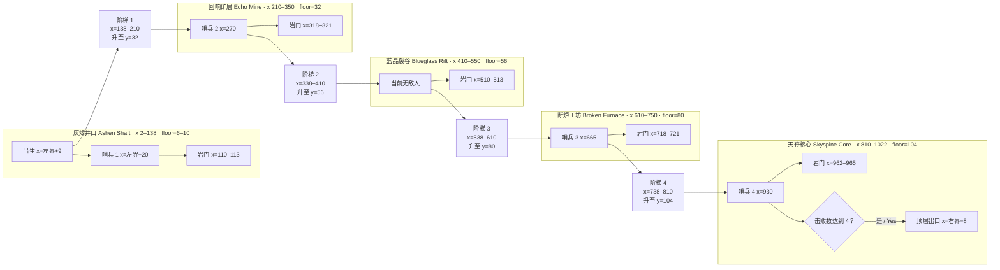

# 五层关卡：灰烬深井 / Five-layer level: Ashen Deep

> **状态 / Status：源码已接入；Windows 构建、普通玩家 smoke 与本地模型 F3 单次组合 smoke 已通过；手动跑关和性能仍待验证。**
> Unity Windows 构建成功，无 C# warning/error。修正后的普通玩家 `-smokeTest` 输出 `EMBER_HOLLOW_SMOKE_PASS`，覆盖五层路线/四段楼梯与四敌胜利闭环。本地 SemIf Qwen3.5-4B NF4 模型加载及 F3 单次组合 smoke 输出 `GOD_ACTION_HARNESS_SMOKE_PASS: 组合成功：已命中锁定目标。`，锁定目标实伤通过。手动跑关/跳跃手感、敌人导航和目标设备性能仍待试玩与测量。
>
> 模型状态时间线：上面与下方明确标注日期的 NF4/F3 结论来自 2026-09-24 迁移前历史检查；2026-09-25 游戏后端已切换为 Q4_K_M GGUF，最新构建与玩家进程 smoke 见[神谕服务记录](GOD_DIALOGUE.md)。

## 1. 目标 / Goals

这是一张大型 2D 侧视探索关卡。玩家从灰烬井口逐层上升，通过平台、阶梯和可钻岩门探索路线，并以自己编排的地脉法术处理地形和敌人。设计借鉴自由组合与可破坏环境的抽象思路，不复用其他游戏的法术内容或关卡布局。

当前源码配置为 **1024×160 格**，每格 **0.5 Unity 单位**，地图总尺寸约 **512×80 世界单位**；扣除四周边界后，可玩范围约 **510×78 单位**。地形在初始化时一次性生成。

This is a large 2D side-view exploration level. The player ascends from the Ashen Shaft through platforms, stairs, and drillable rock gates, using authored terrain spells to solve traversal and combat problems. It borrows high-level ideas around combinable tools and destructible environments, without reusing another game’s spell content or level layout.

The current source configures **1024×160 cells**, at **0.5 Unity units per cell**: about **512×80 world units** overall and **510×78 playable units** after the boundary. Terrain is generated at initialization.

## 2. 玩家流程 / Player flow

1. 从地图左侧可玩边界 +9 单位出生，在灰烬井口熟悉移动、跳跃、射击和地形破坏。
2. 第一名哨兵位于左边界 +20 单位，供玩家尽早遭遇，也供开局 F3 组合寻找目标。
3. 沿 x≈138–210 的第一段阶梯上升至回响矿层；途中可用钻脉打开固定岩门。
4. 经过蓝晶裂谷与断炉工坊，沿另外三段阶梯逐层上升。上层房间含平台、固定种子沙堆和材料门。
5. 在天脊核心接近最右侧出口。清除四名敌人后出口颜色转为开启态；进入出口触发胜利。

路线和敌人坐标已在源码中布置。阶梯实际跳跃手感、所有敌人的导航可达性及整关连续通关尚待玩家进程验证。

The player spawns 9 units from the playable left edge. The first sentry is placed 20 units from that edge for an early encounter and the opening F3 target search. The player then ascends through the Echo Mine, Blueglass Rift, Broken Furnace, and Skyspine Core. The summit gate changes to its open state after all four enemies are defeated; entering it triggers victory. The source placements exist, while stair feel, enemy navigation, and a full uninterrupted run still need validation.

## 3. 五层结构 / Five-layer structure

以下 x/y 是格子坐标，x 向右、y 向上。高层“地板行”指生成阶梯/房间地板的基准行；井口地板则随 `FloorCell(x)` 在 6–10 行起伏。房间范围与阶梯由 `GridTerrain.GenerateLayeredRoute()` 生成。

| 层 / Layer | 房间 x 范围 / Room x | 地板基准 / Floor row | 源码内地形与标志 / Terrain and landmarks in source |
| --- | ---: | ---: | --- |
| 灰烬井口 / Ashen Shaft | 2–138 | `FloorCell(x)` = 6–10 | 暖褐低饱和背景色带；出生点左边界 +9；哨兵 1 在左边界 +20；x=110–113 有 4 格宽、8 格高可破坏岩门；井口上方生成天花板平台。 |
| 回响矿层 / Echo Mine | 210–350 | 32 | 青绿低饱和背景色带；x=318–321 材料门，4 格宽、8 格高；固定种子平台；沙堆中心 x=270。哨兵 2 位于 x=270。 |
| 蓝晶裂谷 / Blueglass Rift | 410–550 | 56 | 蓝色低饱和背景色带；x=510–513 材料门，4 格宽、7 格高；固定种子平台；沙堆中心 x=465。当前该层未放置敌人。 |
| 断炉工坊 / Broken Furnace | 610–750 | 80 | 赤褐低饱和背景色带；x=718–721 材料门，4 格宽、8 格高；固定种子平台；沙堆中心 x=665。哨兵 3 位于 x=665。 |
| 天脊核心 / Skyspine Core | 810–1022 | 104 | 紫色低饱和背景色带；x=962–965 材料门，4 格宽、8 格高；固定种子平台；沙堆中心 x=920；哨兵 4 位于 x=930；出口距可玩右边界 8 世界单位。 |

各层背景使用对应的低饱和色带帮助玩家识别区域：井口暖褐、矿层青绿、裂谷蓝、工坊赤褐、天脊紫。色带仅为背景氛围与分层提示，不改变地形材料或碰撞。岩门位于该层基准地板上方，材料为可破坏岩石。当前没有专属地形材质贴图或关卡说明牌；玩家通过已有钻脉/爆破工具辨识并打开。

Each region has a low-saturation background band to aid recognition: warm brown for the shaft, teal-green for the mine, blue for the rift, rust-brown for the furnace, and purple for the summit. These are atmospheric background cues only; they do not change terrain material or collision. Rock gates are destructible rock above each layer’s floor. There is no unique terrain material art or instructional signage; players can identify and open gates with existing drill/blast tools.

### 四段阶梯 / Four stair connectors

| 连接段 / Connector | x 格范围 / x cells | 下层→上层基准行 / Lower → upper rows | 生成方式 / Generation |
| --- | ---: | ---: | --- |
| 阶梯 1 | 138–210 | `FloorCell(138)`（当前为 7）→32 | 13 个采样台阶平台；顶端与 x≥210 的矿层地板接合。 |
| 阶梯 2 | 338–410 | 32→56 | 12 个采样台阶平台；顶端与 x≥410 的裂谷地板接合。 |
| 阶梯 3 | 538–610 | 56→80 | 12 个采样台阶平台；顶端与 x≥610 的工坊地板接合。 |
| 阶梯 4 | 738–810 | 80→104 | 12 个采样台阶平台；顶端与 x≥810 的核心地板接合。 |

`AddClimbStairs` 将高度差按每级最多 2 格分段，并在每个采样点放置 **5 格宽**（中心左右各 2 格）的平台。房间地板从阶梯终点开始，避免最后一级被提前出现的地板遮挡；`HasValidLayeredRoute()` 还检查每相邻落脚面的行差不超过 2。玩家跳跃速度为 10、重力为 -18，理想抛物线峰值约 2.8 世界单位；水平移动速度为 6。几何与路线生成已由普通 smoke 覆盖，但连续上阶的手感、掉落回退和敌人是否能通过仍待手动验证。

`AddClimbStairs` divides elevation into increments of at most 2 cells and places **5-cell-wide** platforms (2 cells either side of center) at each sample. Each upper room floor begins at its stair endpoint, avoiding an early floor overlap that would hide the last landing; `HasValidLayeredRoute()` checks that adjacent landing rows differ by no more than 2. The player’s jump speed is 10, gravity is -18, theoretical ballistic height is about 2.8 world units, and horizontal speed is 6. Route geometry is covered by the ordinary smoke test; traversal feel, recovery after a fall, and enemy traversal still need hands-on validation.

### 纵剖面与路线 / Side profile and route

## 4. 地标、敌人与出口 / Landmarks, enemies, and exit

- **出生点 / Spawn:** `GameWorld` 将玩家置于 `PlayableMinX + 9`，Y 使用井口 `FloorY` 取值。
- **敌人 / Enemies:** 当前总数为 4，分别生成于：哨兵 1（左界 +20，井口）；哨兵 2（格子 x=270，回响矿层）；哨兵 3（格子 x=665，断炉工坊）；哨兵 4（格子 x=930，天脊核心）。蓝晶裂谷暂时没有敌人，因此不应描述为每层各有一名。
- **材料门 / Gates:** 位于 x=110、318、510、718、962；宽 4 格，岩石深度依次为 8、8、7、8、8 格。层基准为 `FloorCell(x)`、32、56、80、104。
- **沙堆 / Sand deposits:** 井口原有小沙堆之外，上层中心大致位于 x=270、465、665、920。位置固定，作为地形交互与视觉点缀。
- **出口 / Exit:** 出口生成在最右侧可玩边界内 8 世界单位、天脊核心地板上方。`GoalPortal` 在击败数达到 `RequiredKills=4` 后改变颜色；玩家进入触发胜利。

## 5. 当前实现与限制 / Implementation and limitations

### 已接入源码 / Implemented in source

- `GridTerrain.Width=1024`、`Height=160`、`CellSize=0.5`、五层地板基准行 32/56/80/104。
- 五个房间基准范围、四段阶梯、固定种子交错平台、五处可破坏岩门和上层沙堆生成。
- 五层低饱和背景色带已接入，用于区域视觉识别；地形材料与碰撞保持不变。最终 Windows 构建和普通玩家 smoke 已通过；相机渲染截图确认灰烬井口色带及地形显示正常。五层同屏总览、两种语言 HUD 布局仍待单独人工检查。
- `GameWorld` 创建四名敌人、玩家、顶层出口；四敌清除后开启出口。相机边界读取整张地形的可玩范围。
- 地形状态由一个 `GridTerrain` 材料数组持有，并投影到**单个 Tilemap、单个 TilemapRenderer 和单个 TilemapCollider2D**。当前**未做 Tilemap 分块、区块流式加载或按镜头范围卸载**。
- 沙格索引和爆破分批写 Tilemap 等性能结构仍在代码中；它们不等于目标设备帧率承诺。

### 自动验证已通过 / Automated validation passed

- Unity Windows 构建成功；构建日志无 C# warning/error。
- 修正后的普通玩家 `-smokeTest` 输出 `EMBER_HOLLOW_SMOKE_PASS`。该 smoke 检查五层和四段阶梯路线不变量，并完成四名敌人的击败计数与胜利状态闭环。
- 本地 SemIf Qwen3.5-4B NF4 模型加载与 F3 **单次组合** smoke 通过，日志为 `GOD_ACTION_HARNESS_SMOKE_PASS: 组合成功：已命中锁定目标。`，模型选择、锁定目标和真实伤害链路在该次检查中通过。
- 上述结果仅确认构建与自动化检查，不代表手动移动体验、敌人导航或性能基准已通过。语言切换/持久化 smoke 通过；English HUD 的实机布局检查仍待完成。

### 仍待验证 / Still needs validation

- 每段阶梯的手动跳跃手感、回退/落地恢复、连续攀登；房间平台与岩门是否妨碍可读路线。
- 敌人在悬台、阶梯、破坏后的地形上能否有效导航并进入战斗；尤其蓝晶裂谷没有分配敌人是否符合预期节奏。
- 目标设备的启动绘制耗时、稳定帧耗时、TilemapCollider2D 重建、GC、沙格更新和大范围爆破实测。

**性能边界 / Performance boundary:** 1024×160 全图初始化与绘制发生在同一个 Tilemap 上。TilemapCollider2D 也覆盖整张地形；破坏地形时局部 `SetTile(s)` 可能触发 Unity 内部碰撞网格更新。项目尚未采用分区 Tilemap 或流式加载，故大地图实测前不能断言性能足够。若基准显示瓶颈，再评估分块渲染/碰撞；`GridTerrain` 应继续作为材料状态唯一权威写入点。

The full 1024×160 terrain is initialized and painted into one Tilemap with one TilemapCollider2D; there is no chunking or streaming. Local tile edits can still cause Unity-side collider work. Performance must be measured on target hardware before claiming the larger map is adequately optimized. If profiling finds a bottleneck, evaluate chunked rendering/collision while keeping `GridTerrain` the single authoritative material-state writer.

## 6. 验证清单 / Validation checklist

1. **已通过：**Unity Windows 构建成功且无 C# warning/error；修正后的普通玩家 `-smokeTest` 输出 `EMBER_HOLLOW_SMOKE_PASS`，覆盖五层/四段楼梯路线与四敌胜利闭环。本地 SemIf Qwen3.5-4B NF4 F3 单次组合 smoke 输出 `GOD_ACTION_HARNESS_SMOKE_PASS: 组合成功：已命中锁定目标。`，锁定目标实伤通过。
2. 检查地图宽高、可玩边界、五层地板、四段阶梯、五处材料门及其可破坏性。
3. 手动从起点连续跑到核心，每段阶梯测试上行、下行、误落后恢复、镜头跟随与平台边缘碰撞。
4. 验证四名敌人出生位置与可达性、击败计数、出口锁定/开放、进入出口、死亡重开和重复通关。
5. 检查固定种子重开后的布局一致性，以及沙堆/随机平台不会封死主路线或困住玩家。
6. 在目标设备测量全图生成、TilemapCollider2D 更新、稳定帧耗时、GC 和大范围爆破；根据数据决定是否分块。记录设备、构建配置和场景条件，不从代码预算推算 FPS。
7. **待试玩/测量：**手动连续跑关与跳跃手感、敌人导航，以及目标设备性能基线。
8. 新增玩家可见文本继续使用中文默认和英文同步，并经 `GameLocalization.T(中文, English)` 提供。

The Windows build passed without C# warnings/errors. Ordinary player `-smokeTest` emitted `EMBER_HOLLOW_SMOKE_PASS`, covering the five-layer/four-stair route invariant and four-enemy victory loop. A single local SemIf Qwen3.5-4B NF4 F3 combo smoke emitted `GOD_ACTION_HARNESS_SMOKE_PASS: 组合成功：已命中锁定目标。`; the selected combo dealt damage to its locked target. Hands-on full-level traversal, jump feel, enemy navigation, and target-device performance remain to be tested or measured.

