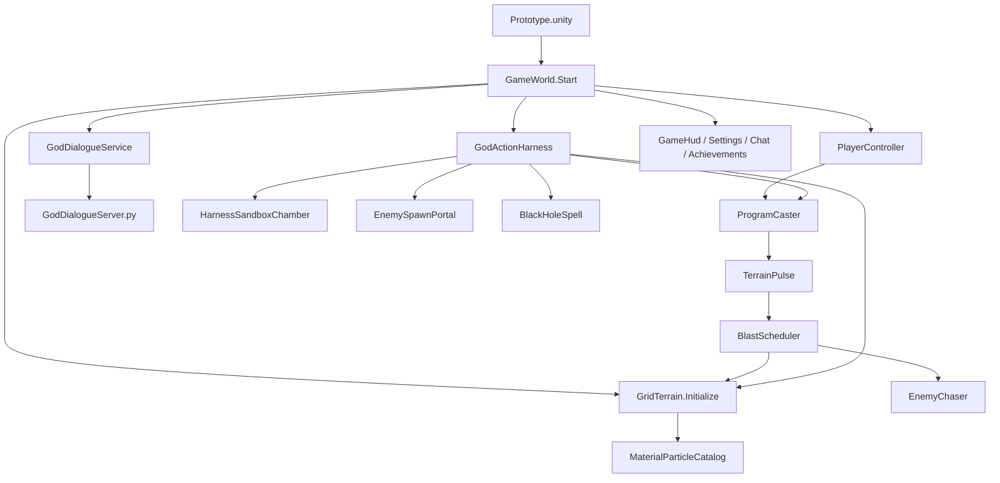

# 源码解读与逻辑定位

更新时间：2026-09-25。本文按当前工作区的源码整理，是面向后续开发者和模型的导航文档：先定位入口和状态所有者，再沿调用链找到具体实现。修改代码后要同步维护本文件，详见根目录 `AGENTS.md`。

## 1. 工程概览

- Unity 版本：`6000.0.28f1c1`；Windows x64 构建入口在 `Assets/Editor/GameProjectSetup.cs`。
- 场景入口：`Assets/Scenes/Prototype.unity`。场景中的 `GameWorld` 是运行时装配根；`GameWorld.Start()` 创建地形、玩家、敌人、UI、施法器、神谕服务与 Harness 组件。
- 运行时 C#：`Assets/Scripts/` 下 24 个 `.cs` 文件。
- 本地模型适配器：`Assets/StreamingAssets/LocalAI/GodDialogueServer.py`。它启动 Python loopback API，再管理 llama.cpp 模型服务。模型权重、llama.cpp、tokenizer 和 Python 环境在项目外部，布局见 `docs/GOD_DIALOGUE.md`。
- 程序化场景生成：`GameWorld` 和 `GridTerrain` 直接创建大部分运行时对象及视觉，不依赖外置角色美术包。

本地 Unity 工程会把 C# 编译到 `Assembly-CSharp.dll`。公开 Demo 是运行时二进制包，不包含 `.cs`、Unity 项目目录或 Python sidecar 源文件；无模型的下载包不能启动本地神谕服务，游戏基础玩法可运行。

## 2. 主调用图

### 玩家法术流程

1. `PlayerController.Update()` 读移动、跳跃、瞄准、开火和界面快捷键；开火时由 `ProgramCaster.TryCast()` 请求施法。
2. `ProgramCaster.Compile()` 把玩家的 `ModuleKind` 序列编译成有界 `PulseSpec` 发射组，检查资源并分配运行 token。
3. `TerrainPulse.Spawn()` 创建弹体；`TerrainPulse.Update()` 推进并检测命中。敌人命中走 `EnemyChaser.TakeDamage()`，地形命中走 `BlastScheduler.QueueBlast()` 或 `GridTerrain` 的钻脉接口。
4. `BlastScheduler` 延后爆破、敌人伤害、回响和分帧地形工作；它通过 `GridTerrain` 改权威地形数据，不直接写 Tilemap。`X` 经施法器/运行 token 取消持续法术。

### 神谕创世流程

1. `GodChatWindow` 显示 F2 对话和 F3 组合入口。只有聊天输入最前面含 `<作弊码>` 才进入创世操作。
2. `GodActionHarness.RequestCreativeAction()` 先检查游戏状态和队列，按目标文本筛出 Unity 已登记 ID；随后保存快照/版本并暂停时间。
3. `GodDialogueService.RequestDecision()` 把 request ID 和有限候选交给 sidecar `/decide`。模型只能从候选中选择，不返回可执行代码、任意坐标或参数。
4. `HarnessSandboxChamber` 将 Unity 组装的固定参数转成不可变 `HarnessScriptStep`，规范化字段并计算 SHA-256；在同场景镜头外的独立数据投影中预演单步。
5. 预演通过后 `GodActionHarness` 重验状态版本，在主线程调用已登记玩法接口，随后读取实时世界状态作验收。强敌刷怪示例会先验门户，再修改 profile，最后验证新刷出的敌人参数。
6. 任务继续选择后续一步，或完成/取消/超时。黑洞有全地形与敌人快照撤销；传送门和无限能量可关闭；其他破坏操作尚无通用 undo journal。

**实现边界：**当前没有 Python 子集 parser/interpreter。模型也没有在写自由脚本；创世流程以自然语言意图匹配 Unity 固定操作，逐步从封闭候选中选择。`HarnessSandboxChamber` 是单步数据投影预演，不是独立物理世界；正式操作仍必须通过实机状态检查。

## 3. 权威状态和跨模块约束

| 状态 | 权威所有者 | 其他模块如何使用 |
| --- | --- | --- |
| 材料格、64 粒子占据位、Tilemap 与碰撞投影 | `GridTerrain` | 弹体、爆破、黑洞和 Harness 只能通过其接口读写；改材料后由它同步显示/碰撞。 |
| 粒子材料参数 | `MaterialParticleCatalog` | `GridTerrain`、黑洞和验收读取同一材料枚举/参数表，避免各自维护重复值。 |
| 运行中法术、能量、用户程序和取消令牌 | `ProgramCaster` | 编辑器调用它改序列，弹体带着编译后的 `PulseSpec` 和 token 执行。 |
| 爆破队列和地形工作预算 | `BlastScheduler` | 弹体只提交请求；调度器逐帧处理并记录完成数/待执行工作。 |
| 玩家、敌人、关卡进度、创世设施 | `GameWorld` 及对应 actor 组件 | `GameWorld` 负责创建、生命周期和胜负；`EnemyChaser` 自己负责移动/受伤。 |
| 模型请求历史、流式回复、HTTP 与服务状态 | `GodDialogueService` | `GodChatWindow` 展示；`GodActionHarness` 请求决策。后台响应通过主线程队列回调 Unity。 |
| 单次 Harness 任务与预演状态 | `GodActionHarness` / `HarnessSandboxChamber` | 前者拥有流程和状态复核，后者只计算封闭 ID 的单步投影和回执。 |

不要绕开领域所有者直接改状态：例如不要从 AI 或 UI 直接写 `GridTerrain` 的数组/Tilemap，不要让模型生成新的原语 ID，不要让预演房间查询污染实机敌人或击杀数。

## 4. 源文件逐项索引

以下路径均相对仓库根目录。修改时先读所属架构文档，再沿“关键入口”追踪调用者和状态所有者。

### 世界、地形、物理与敌人

| 文件 | 作用与关键入口 |
| --- | --- |
| `Assets/Scripts/GameWorld.cs` | 运行时装配根和胜负状态。重点看 `Awake()`、`Start()`、`CreateHarnessSandboxChamber()`、`CreatePlayer()`、`CreateEnemy()`、传送门/黑洞/Harness 填充入口、`Restart()`、`WinRun()`。同一文件还包含命令行 smoke coroutine，便于搜索 `-...SmokeTest`。 |
| `Assets/Scripts/GridTerrain.cs` | 地形权威状态、程序化关卡、宏观 Tilemap 与 8×8 稀疏细粒子投影。重点看 `Initialize()`、`GenerateCells()`、`GenerateLayeredRoute()`、`DamageCircle()`、`FillBlocks()`、`FillParticle()`、`ExtractCellParticles()`、`CaptureSnapshot()`、`RestoreSnapshot()`、`DamageCellsBatch()`、`DrillSegment()`、`FixedUpdate()`、`SimulateFineParticles()`。细节见 `docs/architecture/terrain.md` 与 `docs/基础粒子.md`。 |
| `Assets/Scripts/MaterialParticleCatalog.cs` | `ParticleMaterial` 枚举和材料参数唯一目录；提供每种材料的硬度阈值、密度、离散内聚、粘度、壁附阈值与颜色。改材料时同步 `docs/现代物理学.md`、`docs/基础粒子.md`；SI 参考和游戏调参不可混写。 |
| `Assets/Scripts/BlackHoleSpell.cs` | 黑洞生命周期与撤销快照。`Initialize()` 准备地形/演员状态，`SetDurationAndStart()` 启动有限或无限法术，`Update()` 分批扫描，`Undo()` 恢复地形、敌人和传送门；黑洞无视普通硬度阈值。 |
| `Assets/Scripts/PlayerController.cs` | 输入采样、移动、跳跃缓冲/离地宽限、瞄准与射击。`Update()` 采集输入，`FixedUpdate()` 推进刚体，`RefreshGrounded()`/`HasTerrainGroundBelow()` 判定接地，`Shoot()` 交给 `ProgramCaster`。 |
| `Assets/Scripts/EnemyChaser.cs` | 敌人运动、接地/越障、玩家接触伤害、强度档、击败和击退。重点看 `FixedUpdate()`、`TryDamagePlayer()`、`ConfigureStrengthProfile()`、`TakeDamage()`、`ApplyKnockback()`。传送门归属 ID 用于只更新该门生成的敌人。 |
| `Assets/Scripts/EnemySpawnPortal.cs` | 有界周期刷怪门。`Initialize()` 绑定世界/层，`ConfigureEnemyStrength()` 更新该门拥有的活敌，`Update()` 按间隔生成并受存活数上限限制，`StopPortal()` 结束生成。 |
| `Assets/Scripts/EasterEggRoomTrigger.cs` | 玩家进入隐藏神谕房时将触发转交给 `GameWorld.TryTriggerRoomEasterEgg()`。 |
| `Assets/Scripts/HarnessRoomExitPortal.cs` | 玩家触碰出口后调用 `GameWorld.ReturnPlayerFromHarnessRoom()` 回到关卡表面。 |

### 玩家法术与战斗

| 文件 | 作用与关键入口 |
| --- | --- |
| `Assets/Scripts/ProgramCaster.cs` | 玩家可编辑法术序列、编译、费用、发射、能量回收、运行 token 和存档。重点看 `TryAdd()`/`Move()`/`RemoveAt()`、`LoadPreset()`、`TryCast()`、`Compile()`、`StopAll()`。新增 `ModuleKind` 时还要更新 `GameLocalization.ModuleName()`、编辑器菜单、成本和 smoke 检查。 |
| `Assets/Scripts/ProgramEditor.cs` | 暂停状态下的法术序列编辑 UI。`Open()`/`Close()` 管理时间缩放；`DrawModuleList()` 和 `DrawPalette()` 调 `ProgramCaster` 的正式 API。 |
| `Assets/Scripts/TerrainPulse.cs` | 法术弹体飞行、碰撞筛选、敌人/地形命中、钻脉或爆破提交。`Spawn()` 接受已编译 `PulseSpec`，`Update()` 飞行，`HandleHit()` 分派命中，`QueueDetonation()` 将爆破交给 scheduler。 |
| `Assets/Scripts/BlastScheduler.cs` | 爆破请求队列、延时与回响、敌人范围伤害、地形候选和逐帧工作预算。`QueueBlast()` 是弹体/创世操作提交点；`Update()` 推进队列；`ProcessTerrain()` 改地形只调用 `GridTerrain`。 |
| `Assets/Scripts/BlastVisual.cs` | 爆破环形视觉和淡出，`Show()` 创建短时效果；无伤害和地形副作用。 |

程序模块语义和上限见 `docs/PROGRAM_SYSTEM.md`、`docs/architecture/program-compiler.md`；神谕玩法原语与硬上限见 `docs/architecture/action-primitives.md`。

### 本地神谕与 Agent Harness

| 文件 | 作用与关键入口 |
| --- | --- |
| `Assets/Scripts/GodChatWindow.cs` | F2 神谕聊天 UI、消息列表、输入提交和状态。`Submit()` 把玩家文字交给 `GodDialogueService` 或识别创世暗语入口。 |
| `Assets/Scripts/GodDialogueService.cs` | Sidecar 生命周期、聊天消息、历史压缩、流式 HTTP、候选决策和线程切换。重点看 `BeginRun()`、`Submit()`、`RequestDecision()`、`ScoreDecisionAsync()`、`StartSidecar()`、`StreamReplyAsync()`、`RequestSummaryAsync()`、`BuildWorldSnapshot()`、`StopSidecar()`。普通文字回复和 `/decide` 操作决策是分离路径。 |
| `Assets/StreamingAssets/LocalAI/GodDialogueServer.py` | 本地 Python HTTP 适配器：启动 llama.cpp 服务、聊天流式代理、历史摘要/取消与 `/decide` 候选评分。它只应监听 `127.0.0.1`；详细协议、模型路径、量化与性能限制见 `docs/GOD_DIALOGUE.md`。 |
| `Assets/Scripts/GodActionHarness.cs` | 神谕决策的授权、快照、有限候选、执行、观察、重试/取消和逐步验收。主要入口 `RequestFaultlineCharge()`/`RequestCreativeAction()`；阶段追踪 `DetectCreativeIntents()`、`BuildCreativeRequest()`、`OnCreativeDecision()`、`RevalidateCreativeSnapshot()`、`ExecuteCreativeAction()`、`CompleteCreativeStep()`、`FinishCreativeTask()`。改动前必须理解调用到的领域接口和撤销范围。 |
| `Assets/Scripts/HarnessSandboxChamber.cs` | 同场景镜头外的单步数据投影预演。`HarnessScriptStep` 固定操作参数并规范化哈希；`BeginTask()`、`TryCompileAndPreview()`、`RecordLiveCommit()`、`EndTask()` 生成沙盒/实机回执。它不是完整物理副本，也不替代正式执行前状态复核。 |

Harness 总体授权、脚本目标架构与当前实现差距见 `docs/architecture/ai-harness.md`。Python 的 `if/for/while` parser/interpreter 还未实现；现有 Python 文件是模型服务适配器，不是神谕脚本执行器。

### HUD、设置、本地化与成就

| 文件 | 作用与关键入口 |
| --- | --- |
| `Assets/Scripts/GameHud.cs` | 生命、关卡、能量、状态和操作提示 HUD；创建设置入口和成就入口。新增文案使用双语状态，不在多个 UI 复制翻译规则。 |
| `Assets/Scripts/GameLocalization.cs` | 当前 UI 语言、中文默认值、本机持久化、动态字体和模块名。统一用 `GameLocalization.T(中文, English)`；切换入口 `SetLanguage()`。 |
| `Assets/Scripts/GameSettingsMenu.cs` | 暂停游戏的设置窗口和即时语言选择，关闭时协调恢复时间缩放。 |
| `Assets/Scripts/AchievementService.cs` | 成就定义、ID 校验、解锁状态、本地 `PlayerPrefs` 持久化和通知。普通成就 ID 为 `first_victory`，隐藏成就为 `hidden_gods_room`；`TryUnlock()` 是事件接入点。当前未接 Steamworks。 |
| `Assets/Scripts/AchievementJournal.cs` | `J` 键打开普通/隐藏成就列表；隐藏成就未解锁时使用未知状态显示。打开/关闭会协调暂停。 |
| `Assets/Scripts/AchievementToast.cs` | 新解锁成就的普通/隐藏提示，按 unscaled time 显示并淡出。 |

语言和展示要求见 `docs/LOCALIZATION.md`；成就彩蛋设定见 `docs/EASTER_EGG_MECHANIC.md`。

### Unity 编辑器工具

| 文件 | 作用与关键入口 |
| --- | --- |
| `Assets/Editor/GameProjectSetup.cs` | `CreateScene()` 生成启用 `Prototype.unity` 并将 `GameWorld` 放入场景；`BuildWindows()` 生成 `Builds/EmberHollow.exe` 和对应 `_Data` 运行时。构建产物会包含托管程序集，发布包不包含 `.cs` 项目源码。 |
| `Assets/Scenes/Prototype.unity` | Unity 序列化场景入口。大部分关卡、演员和 UI 在 `GameWorld.Start()` 动态组装；改场景后仍要核对运行时创建逻辑。 |
| `Assets/Scripts/*.meta` 与 `Assets/Editor/*.meta` | Unity 资产 GUID/导入元数据，不是玩法逻辑；新增资产应保留 Unity 生成的 `.meta`。 |

## 5. 常见修改该从哪里开始

| 想改什么 | 首先检查 | 还要同步检查 |
| --- | --- | --- |
| 新增材料/粒子参数 | `MaterialParticleCatalog.cs`、`GridTerrain.cs` | `基础粒子.md`、`现代物理学.md`、黑洞和粒子 smoke |
| 修正地形破坏/填充/碰撞 | `GridTerrain.cs` | `BlastScheduler.cs`、`BlackHoleSpell.cs`、`docs/architecture/terrain.md`、地形 smoke |
| 增加玩家法术模块 | `ProgramCaster.cs` | `ProgramEditor.cs`、`GameLocalization.cs`、程序文档与组合/取消 smoke |
| 增加模型可调用操作 | `GodActionHarness.cs` 封闭候选与执行、`HarnessSandboxChamber.cs` 单步投影 | `action-primitives.md`、undo/取消、实时验收、相应真实模型 smoke |
| 修改模型协议或上下文 | `GodDialogueService.cs` 与 `GodDialogueServer.py` | `GOD_DIALOGUE.md`、聊天/候选覆盖/压缩/取消回归 |
| 增加语言或界面文案 | `GameLocalization.cs` 和对应 UI | 同次提交中英双语；切换语言检查 HUD、设置、编辑器、神谕和成就 |
| 增加成就/彩蛋 | `AchievementService.cs`，再接 `GameWorld` 事件 | `AchievementJournal.cs`、`AchievementToast.cs`、成就文档；不要声称 Steam 成就已接入 |
| 改关卡/玩家出生/胜负 | `GameWorld.cs`、`GridTerrain.cs` | `LEVEL_DESIGN.md`、出生/落脚/敌人/出口与全程路线 smoke |

## 6. 验收入口

`GameWorld.Start()` 根据命令行参数启动自动检查。当前主要 flag：

- `-smokeTest`：地图、出生/出口、地形更新、移动/战斗闭环、程序持续回响/取消和通关状态。
- `-movementSmokeTest`：跳跃缓冲与贴地物理边界。
- `-actionHarnessSmokeTest`：固定 F3 组合决策与目标命中。
- `-creationStrongPortalSmokeTest`：真实模型执行强敌传送门两步任务和实时强度检查。
- `-creationBlackHoleSmokeTest`：真实模型完成黑洞准备、无限持续、全图吞噬和实机验收。
- `-harnessSandboxSmokeTest`：试炼隔离、状态版本及预演边界。
- `-blackHolePhysicsSmokeTest`：粒子数/硬度/黑洞材料吞噬/撤销。
- `-mapDemolitionSmokeTest`：地图爆破后检查可破坏格和基岩边界。

有本地模型的测试会启动 Python/llama.cpp sidecar并占用相应 GPU 显存；在没有配置模型/sidecar 的公开 Demo 环境中，不把神谕离线提示误报为模型验收。每次报告测试结果时同时记 Unity 构建号/源码状态和对应日志路径。

## 7. 持续维护规则

修改或新增源文件后，同步本导读中的文件职责、关键方法、权威状态和跨模块调用链；增删/重命名文件时更新完整索引。若接口或运行结果变化，同时更新对应 `docs/architecture/` 细节文档和 `README.md` 进度。标明“已实现/已验证”与“目标/计划”的边界，记录实际 smoke/build 证据，不从架构目标推断代码已实现。

